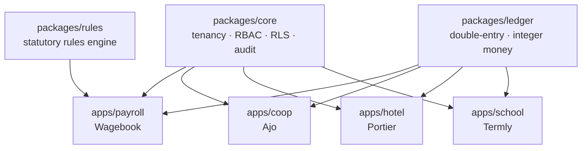

# Business Systems Platform

A multi-tenant platform with a shared core and four vertical products.

```
packages/
  core/      tenancy, RBAC, Postgres RLS, audit log
  ledger/    double-entry accounting — integer money, balanced-or-abort, append-only
  rules/     effective-dated statutory rules engine — pure (snapshot, rule_set) -> payslip
  realtime/  presence, optimistic sync            (planned)
  delivery/  webhook delivery, retries            (planned)
  analytics/ events, funnels, cohorts             (planned)

apps/
  payroll/   Wagebook — multi-jurisdiction payroll (Nigeria first, Kuwait specced)
  coop/      Ajo      — cooperative society: savings, loans, dividends
  hotel/     Portier  — property management: reservations, folios, night audit
  school/    Termly   — timetabling, CBT exams, fees
```

## Status

`packages/core`, `packages/ledger`, `packages/rules`, and the `apps/payroll` run engine are
built and tested. `apps/payroll` now also has a Next.js UI (demo login, dashboard, employees,
payroll runs, payslip PDF) and a demo-org seed script, verified end-to-end locally. **Deployed**
on Vercel against a Postgres (Neon) database — migrated, RLS-scoped `app_user` role, demo org
seeded (22 employees, a posted 2026-03 run); see
[`apps/payroll/README.md`](apps/payroll/README.md#deploying) for the live URL and setup.

`apps/coop`, `apps/hotel`, and `apps/school` — cut from the six-day scope, but now have their
full database layer built ahead of schedule: schema, RLS, and migrations for all three, each
with its own flagship database-level proof (below). `apps/coop` now also has a working Phase 1
UI on top of that (demo login, dashboard, member roster, member statement, contributions
posting run) and a demo seed script; `apps/hotel` and `apps/school` have no application code
yet. See [`docs/SIX-DAY-PLAN.md`](docs/SIX-DAY-PLAN.md) for the original build order, and each
package/app `README.md` for its individual status.

**The RLS test result:** Org A provably cannot read Org B's rows —
[`packages/core/tests/rls.spec.ts`](packages/core/tests/rls.spec.ts), 8 tests, all green.

**The ledger result:** under 100 rounds of randomized balanced postings, the trial balance
sums to exactly `0n` and every account balance matches an independent raw-SQL aggregate —
[`packages/ledger/tests/ledger.spec.ts`](packages/ledger/tests/ledger.spec.ts), 8 tests, all
green. A forged unbalanced entry that bypasses the application-layer check is still rejected
by Postgres's deferred constraint trigger.

**The payroll result:** a payslip computes correctly against the Nigeria Tax Act 2025 PAYE
bands (effective 2026-01-01) — three hand-verified golden cases with the arithmetic shown in
comments, plus a monotonicity property test —
[`packages/rules/tests/golden/ng2026.spec.ts`](packages/rules/tests/golden/ng2026.spec.ts),
18 tests across the package, all green. Sources are cited in
[`packages/rules/src/jurisdictions/ng2026.ts`](packages/rules/src/jurisdictions/ng2026.ts).

**The payroll-run result:** a full run for 20 employees — `draft → calculated → posted`,
mixed pension/NHF opt-in and rent relief, one balanced ledger entry posted per run, both
immutability guards enforced (a posted run can't be recalculated or re-approved), and a
payslip PDF rendered —
[`apps/payroll/tests/payrollRun.spec.ts`](apps/payroll/tests/payrollRun.spec.ts), 4 tests,
all green.

**The coop RLS result:** the same cross-tenant proof as core's, for members, loans, and the
join-based loan-child tables —
[`apps/coop/tests/rls.spec.ts`](apps/coop/tests/rls.spec.ts), 6 tests, all green.

**The hotel result:** a `reservations` exclusion constraint (`btree_gist`) makes selling the
same room twice impossible at the database level — 50 concurrent bookings fired at one room,
exactly one succeeds, the other 49 rejected by Postgres, no application-layer lock —
[`apps/hotel/tests/concurrency.spec.ts`](apps/hotel/tests/concurrency.spec.ts), plus a same-day
turnover and a post-cancellation rebooking both succeeding as they should — 9 tests, all green.

**The school result:** the three hard timetable clash constraints (teacher/room/class, one
period) are enforced by Postgres unique constraints on `timetable_slots` — 50 concurrent
attempts to double-book one teacher in one period, exactly one succeeds, plus direct proofs
for the room and class clash constraints —
[`apps/school/tests/timetableClashes.spec.ts`](apps/school/tests/timetableClashes.spec.ts),
9 tests, all green.

CI (`.github/workflows/ci.yml`) runs all seven suites (Postgres-backed where needed) on every
push and PR.



## Why a monorepo

`ledger` is used by payroll, coop, hotel, **and** school. In four separate repos that means
four copies of the money code — you fix a rounding bug in one and forget the other three.
That isn't hypothetical; it's the default outcome, and it's how financial bugs survive for
years.

Shared code, separate products. The apps are independent at runtime and share nothing but
the packages. One Postgres server, one database per app. If the hotel crashes, payroll
keeps running.

## The rules that are not negotiable

**Money is a `bigint` in minor units.** `0.1 + 0.2 !== 0.3`. A float in a money column is
money silently disappearing, and an accountant will find it before you do.

**Not every currency has two decimals.** `1 KWD = 1000 fils`. Hardcode `× 100` and every
Kuwaiti figure is wrong by a factor of ten. The exponent is looked up per currency.

**Every journal entry balances, or it does not exist.** Checked in the application *and*
by a deferred constraint trigger in Postgres, so no future code path can bypass it.

**The ledger is append-only.** No `UPDATE`, no `DELETE` — enforced by database rules.
Corrections are reversing entries. The wrong number stays visible, linked to what replaced it.

**Allocation sums exactly.** Splitting a dividend across 500 members with naive `floor()`
loses a few kobo. `allocate()` uses the largest-remainder method so the parts sum to the
total exactly. A dividend run that loses ₦3 gets rejected at the AGM.

Full detail on each of these lives in [`.claude/skills/ledger-core/SKILL.md`](.claude/skills/ledger-core/SKILL.md).

## Running it

```bash
pnpm install
docker compose up -d postgres redis

pnpm --filter @bp/core exec tsx scripts/create-db.ts
pnpm --filter @bp/core run migrate
pnpm --filter @bp/core test          # cross-tenant RLS suite

pnpm --filter @bp/ledger exec tsx scripts/create-db.ts
pnpm --filter @bp/ledger run migrate # applies core's migrations first, then ledger's
pnpm --filter @bp/ledger test        # trial-balance property tests

pnpm --filter @bp/rules test         # no database needed — pure computation

pnpm --filter @bp/payroll exec tsx scripts/create-db.ts
pnpm --filter @bp/payroll run migrate # applies core's, ledger's, then payroll's migrations
pnpm --filter @bp/payroll test        # a full 20-employee run, draft -> calculated -> posted

pnpm --filter @bp/coop exec tsx scripts/create-db.ts
pnpm --filter @bp/coop run migrate    # applies core's, ledger's, then coop's migrations
pnpm --filter @bp/coop test           # cross-tenant RLS suite for members/loans/schedules

pnpm --filter @bp/hotel exec tsx scripts/create-db.ts
pnpm --filter @bp/hotel run migrate   # applies core's, ledger's, then hotel's migrations
pnpm --filter @bp/hotel test          # RLS suite + the 50-concurrent-bookings exclusion test

pnpm --filter @bp/school exec tsx scripts/create-db.ts
pnpm --filter @bp/school run migrate  # applies core's, ledger's, then school's migrations
pnpm --filter @bp/school test         # RLS suite + timetable clash-constraint tests
```

`pnpm dev` has nothing to run yet — no UI or HTTP layer exists (see Status above).

## Project context for AI assistants

Full specs and phase-by-phase Build State checklists live in [`.claude/skills/`](.claude/skills):

```
ledger-core/               packages/ledger    — read first, three apps post money through it
helio-saas-platform/       packages/core
cadence-realtime-board/    packages/realtime  (planned)
relay-webhooks/            packages/delivery  (planned)
pulse-analytics/           packages/analytics (planned)
wagebook-payroll/          apps/payroll and packages/rules — build this first
ajo-cooperative/           apps/coop
portier-hotel/             apps/hotel
termly-school/             apps/school
corpus-ai-rag/             a separate, standalone repo — not part of this monorepo
```

Load the relevant skill, read its Build State checklist, resume. Update it when a phase
finishes.

## Planning docs

- [`docs/SIX-DAY-PLAN.md`](docs/SIX-DAY-PLAN.md) — the build order and what's cut
- [`docs/GITHUB-SETUP.md`](docs/GITHUB-SETUP.md) — what gets pushed where, and how repos are described/pinned
