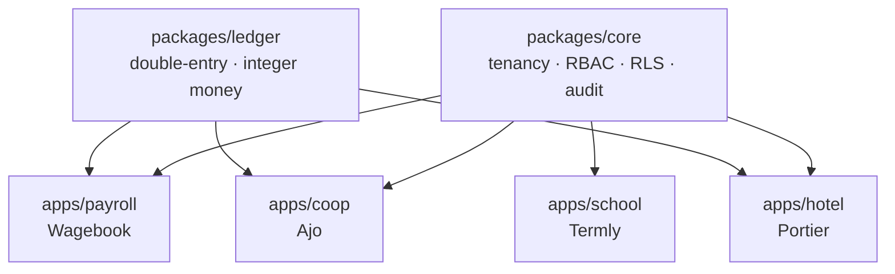

# Business Systems Platform

A multi-tenant platform with a shared core and four vertical products.

```
packages/
  core/      tenancy, RBAC, Postgres RLS, audit log
  ledger/    double-entry accounting — integer money, balanced-or-abort, append-only
  realtime/  presence, optimistic sync            (planned)
  delivery/  webhook delivery, retries            (planned)
  analytics/ events, funnels, cohorts             (planned)

apps/
  payroll/   Wagebook — multi-jurisdiction payroll (Nigeria first, Kuwait specced)
  coop/      Ajo      — cooperative society: savings, loans, dividends
  hotel/     Portier  — property management: reservations, folios, night audit
  school/    Termly   — timetabling, CBT exams, fees
```

## Status

**Scaffold stage.** No application code has landed yet — this repository currently holds the
project structure, specs, and build plan. See [`docs/SIX-DAY-PLAN.md`](docs/SIX-DAY-PLAN.md)
for the build order and what's in scope for the first pass (Wagebook payroll, Nigeria only,
on top of `core` and `ledger`), and each package/app `README.md` for its individual status.



## Why a monorepo

`ledger` is used by payroll, coop, **and** hotel. In four separate repos that means four
copies of the money code — you fix a rounding bug in one and forget the other three. That
isn't hypothetical; it's the default outcome, and it's how financial bugs survive for years.

Shared code, separate products. The apps are independent at runtime and share nothing but
the packages. One Postgres server, one database per app. If the hotel crashes, payroll
keeps running.

## The rules that are not negotiable

**Money is a `bigint` in minor units.** `0.1 + 0.2 !== 0.3`. A float in a money column is
money silently disappearing, and an accountant will find it before you do.

**Not every currency has two decimals.** `1 KWD = 1000 fils`. Hardcode `× 100` and every
Kuwaiti figure is wrong by a factor of ten. The exponent is looked up per currency.

**Every journal entry balances, or it does not exist.** Checked in the application *and*
by a deferred constraint trigger in Postgres, so no future code path can bypass it.

**The ledger is append-only.** No `UPDATE`, no `DELETE` — enforced by database rules.
Corrections are reversing entries. The wrong number stays visible, linked to what replaced it.

**Allocation sums exactly.** Splitting a dividend across 500 members with naive `floor()`
loses a few kobo. `allocate()` uses the largest-remainder method so the parts sum to the
total exactly. A dividend run that loses ₦3 gets rejected at the AGM.

Full detail on each of these lives in [`.claude/skills/ledger-core/SKILL.md`](.claude/skills/ledger-core/SKILL.md).

## Running it

```bash
pnpm install
docker compose up -d postgres redis
pnpm --filter @bp/ledger test        # start here, once packages/ledger exists
pnpm dev
```

These commands are the target shape of the workflow; several of them have nothing to run
against yet (see Status above).

## Project context for AI assistants

Full specs and phase-by-phase Build State checklists live in [`.claude/skills/`](.claude/skills):

```
ledger-core/               packages/ledger    — read first, three apps post money through it
helio-saas-platform/       packages/core
cadence-realtime-board/    packages/realtime  (planned)
relay-webhooks/            packages/delivery  (planned)
pulse-analytics/           packages/analytics (planned)
wagebook-payroll/          apps/payroll       — build this first
ajo-cooperative/           apps/coop
portier-hotel/             apps/hotel
termly-school/             apps/school
corpus-ai-rag/             a separate, standalone repo — not part of this monorepo
```

Load the relevant skill, read its Build State checklist, resume. Update it when a phase
finishes.

## Planning docs

- [`docs/SIX-DAY-PLAN.md`](docs/SIX-DAY-PLAN.md) — the build order and what's cut
- [`docs/GITHUB-SETUP.md`](docs/GITHUB-SETUP.md) — what gets pushed where, and how repos are described/pinned
