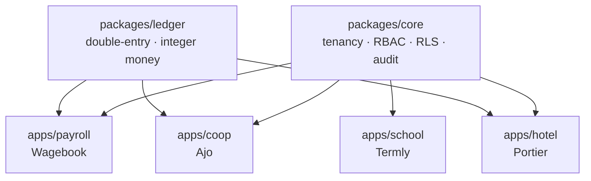

# GitHub Setup

## Push TWO repos. Not six.

The five standalone repos from earlier (`helio`, `cadence`, `pulse`, `relay`) are **superseded**.
They became packages *inside* `business-platform`. Pushing them separately would put four copies
of the same code on your GitHub — the exact problem the monorepo exists to solve, sitting in
public, where an interviewer can see it.

| Archive | Push it? | Why |
|---|---|---|
| `business-platform.tar.gz` | ✅ **yes** | The monorepo. This is the main event. |
| `corpus.tar.gz` | ✅ **yes** | Python + AI. Genuinely standalone. |
| `helio.tar.gz` | ❌ no | → `packages/core` |
| `cadence.tar.gz` | ❌ no | → `packages/realtime` |
| `relay.tar.gz` | ❌ no | → `packages/delivery` |
| `pulse.tar.gz` | ❌ no | → `packages/analytics` |

Keep the four unused archives locally — the READMEs and migrations in them get lifted into the
packages later. Just don't publish them as repos.

---

## Push them

Install the GitHub CLI first (`gh auth login`), then:

```bash
# 1. The platform
tar xzf business-platform.tar.gz
cd business-platform
gh repo create business-platform --public --source=. --push
cd ..

# 2. The AI project
tar xzf corpus.tar.gz
cd corpus
gh repo create corpus --public --source=. --push
cd ..
```

Both archives already contain a git repo with a commit. Nothing to initialise.

### Without `gh`

Create the empty repo on github.com — **no README, no .gitignore, no license**, the archive has
them — then:

```bash
cd business-platform
git remote add origin git@github.com:<username>/business-platform.git
git push -u origin main
```

---

## Descriptions — these do the selling

The description is the only thing a recruiter reads before deciding whether to click. Write it
about the *problem*, not the stack.

```bash
gh repo edit <username>/business-platform \
  --description "Multi-tenant SaaS core + double-entry ledger, with four vertical apps: payroll (multi-jurisdiction), cooperative society, hotel PMS, school management" \
  --add-topic typescript --add-topic nextjs --add-topic postgresql \
  --add-topic multi-tenancy --add-topic double-entry-accounting \
  --add-topic monorepo --add-topic row-level-security

gh repo edit <username>/corpus \
  --description "RAG document intelligence: hybrid retrieval (vector + BM25 + RRF), cross-encoder reranking, streaming answers with clickable citations, and an eval harness that measures it" \
  --add-topic rag --add-topic pgvector --add-topic fastapi \
  --add-topic llm --add-topic information-retrieval --add-topic nextjs
```

**Bad:** *"A payroll app built with Next.js, TypeScript and Tailwind."* Every candidate says this.
**Good:** *"Multi-tenant SaaS core + double-entry ledger…"* — this says you've built something with structure.

---

## Pinned repos — the order is the argument

GitHub gives you six pins. Use four, in this order:

1. **ifs-lms** — real enterprise client, real users. This outranks everything else you own. Lead with it.
2. **business-platform** — the monorepo. Shows you think in systems, not scripts.
3. **corpus** — AI/RAG. The thing everyone asks about in 2026.
4. **oghie-store** — commerce, and it proves range.

Reason for the order: **real client work first, architecture second, hot skill third, breadth fourth.**
A reviewer reads top-left first and often stops after two.

---

## The `.claude/skills/` directory

`business-platform` ships with `.claude/skills/` — ten full specs with Build State checklists.

**Leave it in.** Two reasons:

- **Practical:** clone the repo on any machine, open a chat, say *"continue Wagebook — Phase 2."*
  The spec travels with the code. That's your pause/resume across sessions and machines.
- **Strategic:** it's a public, legible record of how you plan work. Anyone who reads
  `.claude/skills/ledger-core/SKILL.md` sees someone who thought hard about money representation
  before writing a line of code. That's not a liability — it's the strongest thing in the repo.

Mention it in the README (it already is).

---

## README rules

Each repo's README already leads with the hard problem instead of a stack list. Keep it that way.

Before Friday, add to `business-platform`:

- [ ] An **architecture diagram** (Mermaid renders natively on GitHub — no image hosting needed)
- [ ] A **live demo URL** and demo login, right at the top
- [ ] The **green CI badge**
- [ ] The **RLS test result** — "Org A provably cannot read Org B's rows: `tests/rls.spec.ts`"

```markdown

```

---

## Profile README

Update your pitch line. You're no longer just "Next.js SaaS, dashboards, APIs" — you now have a
sharper claim, and it's true:

> Full-stack engineer. I build multi-tenant business systems that handle money —
> payroll, cooperative finance, hotel PMS — on a shared core with a double-entry ledger.
> Next.js · TypeScript · Postgres · Python.

"Systems that handle money" is a much narrower and more valuable claim than "full-stack dev."
Narrow claims get hired. Broad ones get filtered.

---

## Do this in 20 minutes, then stop

Push, describe, pin. Then close the tab and go write `packages/core`.

**GitHub polish is not progress.** You have six days and no payroll engine. A beautifully
described repo with no working demo is worth less than an ugly one with a URL that loads.
